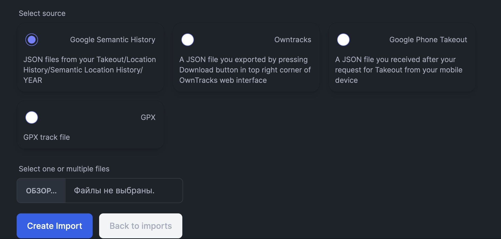

# Import existing data

Dawarich supports importing data from various sources. You can import data from Google Takeout, OwnTracks, GPX routes, and Dawarich.

:::note

Importing process also starts reverse geocoding process for each point imported. This process can take a while, depending on the number of points imported. For mor info on reverse geocoding, refer to [Reverse geocoding tutorial](./reverse-geocoding).

:::

One important thing is that Google Takeout might have at least 3 (three) different formats of location history data: Semantic location history, `Records.json`, and data from a mobile device. Both Semantic location history and `Records.json` can usually be found in the Google Takeout archive created on the web version of Google Takeout. Data from a mobile device can be found in the Google Takeout archive created on a mobile device and usually the file we're interested in is called `location-history.json`.

To import your data, visit Imports -> New Import page of your Dawarich instance. There you will have to select the source of your data, then select one or multiple files to upload, and finally click the "Import" button. The import process will start and you will be redirected to the Imports page. The import process will run in the background and you can ~~check the status of the import on the Imports page~~ No status indication is yet implemented.




## Sources of data

### Google Takeout

Google allows you to download your data from their services using [Google Takeout](https://takeout.google.com/settings/takeout?pli=1). Extract your Takeout archive, go to the Takeout directory, then to the Location History directory. There you will find the following files: `Records.json` and `Semantic location history` directory.

#### Records.json

This file contains your location history in a JSON format. This is usually a big (hundreds of MBs, up to gigabytes) file with all your location history data. Due to the size of this file, its import must be done in manual steps.

1. Upload your Records.json file to your server
2. Copy you Records.json to the `tmp` folder:
```
docker cp Records.json dawarich_app:/var/app/public/imports/Records.json
```
3. Attach to the docker container:
```
docker exec -it dawarich_app sh
```
4. Run the importing task:
```
bundle exec rake import:big_file['public/imports/Records.json','user@example.com']
```
5. Wait patiently for process to finish

After the process is done, contents of your `Records.json` file is queued to be imported in backgroun. You can monitor progress in Sidekiq UI.

All other formats are more convenient for importing your location history data.


#### Semantic location history

This directory contains your location history in JSON files split by months in directories named by the year.

Select `Google Semantic History` as the source of your data and select one or more JSON files to upload. They usually named as `2013_APRIL.json`, `2013_MAY.json`, etc.

Hit "Create Import" and your data will be imported in the background.

#### Phone Takeout (`location-history.json`)

This file contains your location history in a JSON format. This is usually around a 100-200MB file with all your location history data.

Select `Google Phone Takeout` as the source of your data and select the `location-history.json` file to upload.

Hit "Create Import" and your data will be imported in the background.

### OwnTracks and Dawarich

OwnTracks is a mobile application and also a server application that allows you to visualize your location history. Dawarich can import data from OwnTracks in JSON format.

Select `OwnTracks` as the source of your data and select the JSON file to upload. If you previously exported data from Dawarich, it has the same file structure as OwnTracks, so you can import it by selecting `OwnTracks` source as well.

Hit "Create Import" and your data will be imported in the background.

### GPX routes

GPX is a common format for storing GPS data. You can import your GPX routes to Dawarich. Important: Dawarich supports only GPX files of recorded routes, not planned ones.

Select `GPX` as the source of your data and select the GPX file to upload.

Hit "Create Import" and your data will be imported in the background.
